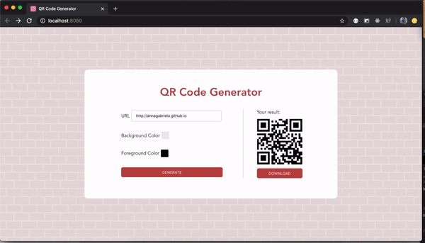

# QR Code Generator

A simple qr code generator made with Vue.js. You can enter a URL (or any text) to generate the QR Code and download as png.



## Project setup
```
yarn install
```

### Compiles and hot-reloads for development
```
yarn serve
```

### Compiles and minifies for production
```
yarn build
```

### Lints and fixes files
```
yarn lint
```

### Customize configuration
See [Configuration Reference](https://cli.vuejs.org/config/).
